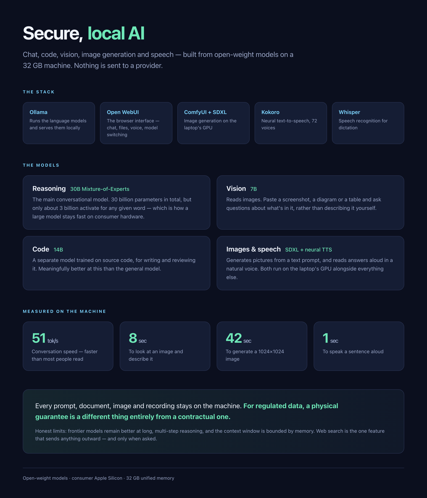
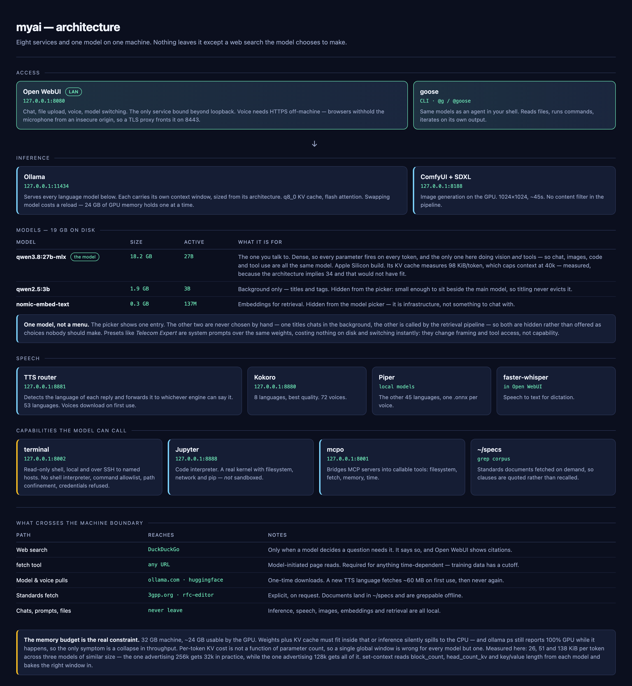

# myai — a local AI stack for macOS and Linux




A complete, self-hosted AI setup that runs on a single machine. Nothing is sent to a
provider. What it can do:

- **Chat and reasoning** — a 30B mixture-of-experts model at conversational speed
- **Work from the terminal** — `goose`, an agent in your shell driven by the same local models
- **Agentic tool use** — the model decides when to read files, fetch a URL or recall a fact, and chains the calls itself
- **Write and run code** — a real Python kernel with filesystem, shell and network access, not a browser sandbox
- **Inspect machines** — a read-only terminal for this computer and any SSH hosts you add: allowlisted commands, no shell, credential paths blocked
- **Read images** — screenshots, diagrams, tables and scanned documents
- **Generate images** — SDXL on the local GPU
- **Speak and listen** — neural text-to-speech in 53 languages, plus dictation
- **Search the web** — with citations, only when you ask for it
- **Remember** — a persistent knowledge graph that carries across conversations
- **48k context** — long documents and long conversations stay in memory

Runs on **macOS** (launchd, Metal) and **Linux** (systemd, CUDA) — same commands on both.

One command starts everything and opens the browser. One command stops everything, clears
residual processes and stays stopped across reboots.

```
myai start     myai stop     myai status     myai logs     myai backup
```

**New here? Read [GUIDE.md](GUIDE.md).** This file covers installing and configuring the
stack; the guide covers using it — what each capability is for, which model to pick, how
to phrase things, and where the sharp edges are.

---

## What you get

| Component | Role |
|---|---|
| **Ollama** | Runs the language models, serves them on a local API |
| **Open WebUI** | Browser interface — chat, file upload, voice, model switching |
| **ComfyUI + SDXL** | Image generation on the GPU |
| **Kokoro** | Neural text-to-speech, 72 voices, 8 languages, best quality |
| **Piper** | Text-to-speech for the other 45 languages, one model per voice |
| **TTS router** | Detects the language of a reply and picks the engine that can say it |
| **faster-whisper** | Speech recognition (built into Open WebUI) |
| **Jupyter** | The code interpreter's kernel — real Python, filesystem and network |
| **mcpo** | Bridges MCP tool servers into Open WebUI as callable tools |
| **terminal** | Read-only shell the model can query, locally and over SSH |
| **caddy** | TLS in front of Open WebUI, so browsers will grant a microphone off-machine |

[](docs/architecture.html)

The diagram above is the same information in one page: which services are reachable from
where, what each model is for, and — the part worth reading twice — the five paths that
actually cross the machine boundary.

Suggested models — swap freely, these are what the defaults assume:

| Model | Size | Role | Measured (Apple M5, 32 GB) |
|---|---|---|---|
| `qwen3.8:27b-mlx` | 18 GB | Everything — chat, images, code, tool use. Dense, 40k context | 17 tok/s |
| `qwen2.5:3b` | 1.9 GB | Background tasks — titles, tags | — |
| `nomic-embed-text` | 274 MB | Embeddings for document retrieval | — |
| SDXL 1.0 | 6.5 GB | Image generation | 42 s/image |

---

## Requirements

### macOS

- **Apple Silicon Mac.** Tested on M5; any M-series works.
- **32 GB unified memory recommended.** 16 GB works if you drop the 30B model and use a 14B or smaller.
- **~40 GB free disk** for all models above.
- **Homebrew.** <https://brew.sh>

> A fanless Mac (Air) throttles under sustained image generation. Chat is unaffected.

### Linux

- **NVIDIA GPU with CUDA** for usable image generation and faster inference. CPU-only works
  for chat but SDXL becomes impractical.
- **32 GB RAM recommended** (or 16 GB VRAM + 16 GB system).
- **systemd** with user units — every mainstream distro.
- Python 3.11 is fetched by `uv`; no system Python is touched.

---

---

## Install — macOS

### 1. Ollama and the models

```bash
brew install ollama
brew services start ollama

> This model needs **ollama 0.34 or newer** — older versions reject the manifest with
> *"requires a newer version of Ollama"* and a 412, before downloading anything. The
> `-mlx` build is compiled for Apple Silicon and is roughly twice the speed of the generic
> one on an M-series Mac; on any other platform use `qwen3.8:27b`.

ollama pull qwen3.8:27b-mlx          # chat, images, code, tools
ollama pull qwen2.5:3b           # background tasks — keep this one small
ollama pull nomic-embed-text     # embeddings
```

> **Pulls sometimes hang at 100%** — the transfer finishes but the client never writes the
> manifest. Kill it and re-run the same `ollama pull`; it resumes from the partial blob and
> completes in seconds rather than re-downloading.

### 2. Open WebUI

It needs Python 3.11 specifically. `uv` fetches that without touching system Python:

```bash
brew install uv
uv python install 3.11

mkdir -p ~/.open-webui/logs
uv venv --python 3.11 ~/.open-webui/venv
VIRTUAL_ENV="$HOME/.open-webui/venv" uv pip install open-webui
```

### 3. ComfyUI and SDXL

```bash
git clone https://github.com/comfyanonymous/ComfyUI.git ~/ComfyUI
cd ~/ComfyUI && git checkout v0.36.0        # pin it
mkdir -p logs models/checkpoints

uv venv --python 3.12 venv
VIRTUAL_ENV="$HOME/ComfyUI/venv" uv pip install torch torchvision torchaudio
VIRTUAL_ENV="$HOME/ComfyUI/venv" uv pip install -r requirements.txt

curl -L -o models/checkpoints/sd_xl_base_1.0.safetensors \
  "https://huggingface.co/stabilityai/stable-diffusion-xl-base-1.0/resolve/main/sd_xl_base_1.0.safetensors"
```

Verify Metal is available — this must print `True`:

```bash
~/ComfyUI/venv/bin/python -c "import torch; print(torch.backends.mps.is_available())"
```

> Deliberately **no ComfyUI Manager and no custom nodes**. Custom nodes are arbitrary Python
> executed in-process; skipping them is most of the supply-chain risk avoided. Download
> checkpoints by hand instead.

### 4. Kokoro (text-to-speech)

```bash
brew install espeak-ng
git clone https://github.com/remsky/Kokoro-FastAPI.git ~/kokoro
cd ~/kokoro && git checkout v0.9.0 && mkdir -p logs

uv venv --python 3.12 venv
VIRTUAL_ENV="$HOME/kokoro/venv" uv pip install -e .
./venv/bin/python docker/scripts/download_model.py --output api/src/models/v1_0
```

> The project is Docker-first and hardcodes container paths. Running it natively requires
> `MODEL_DIR` and `VOICES_DIR` as absolute paths — the launch agent below sets them. Without
> those you get `Read-only file system: '/app'`.

Kokoro covers eight languages well. Piper covers fifty-three, so the two together are what
let the stack speak anything, and a small router in front picks between them:

```bash
brew install ffmpeg                      # see the note below — not optional
python3 -m venv ~/piper/venv
~/piper/venv/bin/pip install piper-tts fastapi uvicorn httpx \
                             lingua-language-detector
mkdir -p ~/piper/logs ~/piper/voices
```

`install.sh` copies `tts/router.py` and `tts/voices.py` into `~/piper` and registers the
service. No voices are downloaded up front — 177 voices at ~60 MB each is 10 GB, almost
all of it for languages you will never use — so the router fetches one the first time a
language comes up and reuses it from then on.

> **ffmpeg is required, and its absence is silent.** Kokoro returns mp3, which Open WebUI
> plays directly; Piper returns WAV, which Open WebUI transcodes. Without ffmpeg every
> non-Kokoro language fails with a bare `[Errno 2] No such file or directory: 'ffprobe'`
> and nothing in the interface says why.

### 5. Code interpreter and agentic tools

A Python kernel for the code interpreter, and the MCP tool servers the model calls.

```bash
# Jupyter — the code interpreter's kernel
python3 -m venv ~/jupyter/venv
~/jupyter/venv/bin/pip install jupyter_server ipykernel numpy pandas matplotlib requests beautifulsoup4

# mcpo — bridges MCP servers to Open WebUI
python3 -m venv ~/mcpo/venv
~/mcpo/venv/bin/pip install mcpo 'mcp<2'      # mcpo 0.0.x needs the mcp 1.x client API

# terminal — the read-only shell the model queries
python3 -m venv ~/terminal/venv
~/terminal/venv/bin/pip install fastapi 'uvicorn[standard]'
```

The MCP servers themselves need `node`/`npx` and `uv`/`uvx` on PATH — they are fetched
on first run. `install.sh` writes `~/mcpo/config.json` and generates both auth tokens.

### 6. Install myai and the launch agents

```bash
./install.sh
```

That copies `myai` to `~/.local/bin`, generates the three launch agents from the templates
with your home directory substituted, and loads them. Make sure `~/.local/bin` is on your PATH.

### 7. Configure Open WebUI

```bash
myai start                     # register an admin account in the browser first
./scripts/configure.sh         # then apply the settings below
```

Or set them by hand in the UI — the script just automates what's described in
[Configuration](#configuration).

---

## Install — Linux

The same five components. Only the packaging and service manager differ.

### 1. Ollama and the models

```bash
curl -fsSL https://ollama.com/install.sh | sh
```

The installer creates a **system-wide** `ollama.service`. myai runs its own user unit instead,
so disable that one or it will hold the port:

```bash
sudo systemctl disable --now ollama
```

Then pull the models — identical to macOS:

```bash
ollama pull qwen3.8:27b        # -mlx is Apple Silicon only; this is the portable build
ollama pull qwen2.5:3b
ollama pull nomic-embed-text
```

### 2. Open WebUI

```bash
curl -LsSf https://astral.sh/uv/install.sh | sh     # if you do not have uv
uv python install 3.11

mkdir -p ~/.open-webui/logs
uv venv --python 3.11 ~/.open-webui/venv
VIRTUAL_ENV="$HOME/.open-webui/venv" uv pip install open-webui
```

### 3. ComfyUI and SDXL

```bash
git clone https://github.com/comfyanonymous/ComfyUI.git ~/ComfyUI
cd ~/ComfyUI && git checkout v0.36.0
mkdir -p logs models/checkpoints

uv venv --python 3.12 venv
# CUDA build — check https://pytorch.org for the index matching your driver
VIRTUAL_ENV="$HOME/ComfyUI/venv" uv pip install torch torchvision torchaudio \
  --index-url https://download.pytorch.org/whl/cu124
VIRTUAL_ENV="$HOME/ComfyUI/venv" uv pip install -r requirements.txt

curl -L -o models/checkpoints/sd_xl_base_1.0.safetensors \
  "https://huggingface.co/stabilityai/stable-diffusion-xl-base-1.0/resolve/main/sd_xl_base_1.0.safetensors"
```

Verify CUDA is visible — must print `True`:

```bash
~/ComfyUI/venv/bin/python -c "import torch; print(torch.cuda.is_available())"
```

> On macOS the equivalent check is `torch.backends.mps.is_available()`. The service file
> passes `--highvram` on both platforms.

### 4. Kokoro (text-to-speech)

```bash
sudo apt install espeak-ng          # or: dnf install espeak-ng / pacman -S espeak-ng

git clone https://github.com/remsky/Kokoro-FastAPI.git ~/kokoro
cd ~/kokoro && git checkout v0.9.0 && mkdir -p logs

uv venv --python 3.12 venv
VIRTUAL_ENV="$HOME/kokoro/venv" uv pip install -e .
./venv/bin/python docker/scripts/download_model.py --output api/src/models/v1_0
```

### 4b. Piper and the TTS router

```bash
sudo apt install -y ffmpeg               # required to play Piper's WAV output
python3 -m venv ~/piper/venv
~/piper/venv/bin/pip install piper-tts fastapi uvicorn httpx \
                             lingua-language-detector
mkdir -p ~/piper/logs ~/piper/voices
```

Voices are fetched on first use rather than up front. See the macOS section above for why,
and for what happens when ffmpeg is missing.

### 5. Code interpreter and agentic tools

A Python kernel for the code interpreter, and the MCP tool servers the model calls.

```bash
# Jupyter — the code interpreter's kernel
python3 -m venv ~/jupyter/venv
~/jupyter/venv/bin/pip install jupyter_server ipykernel numpy pandas matplotlib requests beautifulsoup4

# mcpo — bridges MCP servers to Open WebUI
python3 -m venv ~/mcpo/venv
~/mcpo/venv/bin/pip install mcpo 'mcp<2'      # mcpo 0.0.x needs the mcp 1.x client API

# terminal — the read-only shell the model queries
python3 -m venv ~/terminal/venv
~/terminal/venv/bin/pip install fastapi 'uvicorn[standard]'
```

The MCP servers themselves need `node`/`npx` and `uv`/`uvx` on PATH — they are fetched
on first run. `install.sh` writes `~/mcpo/config.json` and generates both auth tokens.

### 6. Install myai and the service units

```bash
./install.sh                         # detects Linux, writes systemd user units
sudo loginctl enable-linger $USER    # so services survive logout and start at boot
```

Without lingering, systemd user units stop when your last session ends and do not start at
boot. This is the Linux equivalent of launchd agents loading at login.

### 7. Configure Open WebUI

```bash
myai start
./scripts/configure.sh
```

---

## Platform differences at a glance

| | macOS | Linux |
|---|---|---|
| Service manager | launchd agents | systemd user units |
| Ollama supervised by | `brew services` | `myai-ollama.service` |
| GPU backend | Metal (MPS) | CUDA |
| Persist across reboot | `launchctl enable/disable` | `systemctl --user enable/disable` + linger |
| Logs | files under each component | `journalctl --user -u myai-*` |
| Browser open | `open` | `xdg-open` |

`myai` detects the platform and uses the right mechanism; the commands are identical on both.

---

## Configuration

These are the settings that matter. The defaults are wrong for a memory-constrained machine.

### Task model — the most important one

Admin → Settings → Interface → **Task Model** → `qwen2.5:3b`

Open WebUI generates chat titles, tags and follow-up suggestions using your *selected chat
model* by default. That means every message silently fires extra inferences on the 18 GB
model. On a 32 GB machine this forces everything else into swap.

*Measured impact: image generation went from 251s to 84s after this change alone.*

### Model unload timeout

Models sit in RAM for **5 minutes** after use by default. On a memory-constrained machine
that is most of your RAM, held for nothing.

**macOS** — `myai start` sets this for you:
```bash
launchctl setenv OLLAMA_KEEP_ALIVE 60s
brew services restart ollama
```

> Don't put it in Homebrew's plist — `brew services` regenerates that file from its formula
> on every start and silently drops hand-added keys.

**Linux** — already set in `myai-ollama.service` as `Environment="OLLAMA_KEEP_ALIVE=60s"`.
Change it there and `systemctl --user daemon-reload`.

### ComfyUI: keep the model resident

The launch agent passes `--highvram`. Without it ComfyUI reloads 6.5 GB of weights from disk
on *every* render.

*Measured impact: 116s → 42s per image.*

### Text-to-speech

Admin → Settings → Audio → TTS:
- Engine: **OpenAI**
- Base URL: `http://127.0.0.1:8881/v1`  ← the router, not Kokoro directly
- API key: any non-empty string
- Model: `kokoro`, Voice: `af_bella`

Point it at `8880` instead and you get Kokoro alone: excellent English, and every other
language read with an English accent. The router speaks the same OpenAI protocol, so
nothing else in the configuration changes.

### Voice and dictation need HTTPS off-machine

Voice mode and dictation work at `http://127.0.0.1:8080` and fail everywhere else,
including your own LAN address. The cause is a browser rule, not this stack: the
microphone is only available in a **secure context**, and browsers implement that by
making `navigator.mediaDevices` *undefined* on an insecure origin rather than by denying
permission. So the controls render, then fail with nothing informative.

`localhost` counts as secure. `http://192.168.1.x:8080` does not.

```bash
brew install mkcert caddy
mkcert -install                 # once, asks for your password
./scripts/setup-tls.sh          # certificate + reverse proxy config
caddy run --config ~/.open-webui/tls/Caddyfile
```

Then use `https://<your-lan-ip>:8443`. Open WebUI keeps its plain listener on 8080 for
loopback, so nothing that already worked stops working.

Chrome's `unsafely-treat-insecure-origin-as-secure` flag is supposed to solve this without
a certificate. It did not work here, and it would not help Safari or a phone, neither of
which can set Chrome flags — so it is worth knowing about and not worth relying on.

Other devices must trust the CA at `~/Library/Application Support/mkcert/rootCA.pem`
before the microphone works there. On iOS that means installing it as a profile and then
enabling it under **General → About → Certificate Trust Settings**.

### Speech-to-text

Engine: leave **empty** (local faster-whisper). Set Whisper Model to `small` — the `base`
default is noticeably weaker.

`small` is fine for English. For dictation in other languages it is the weak link, and
`medium` is a marked improvement for about 1.5 GB and a little latency.

### Web search

Admin → Settings → Web Search:
- Enable, Engine: **duckduckgo** (no API key needed)
- **Bypass Embedding and Retrieval: ON**

Then, per model, set **Function Calling: Legacy**. With native function calling the model is
merely *offered* a search tool and often declines; with legacy, Open WebUI runs the search and
injects the results.

> Web search is the one feature that sends data off the machine — the query goes to
> DuckDuckGo. Everything else is local.

### Vision models and tools

A vision model without tool support will reject any request carrying tool definitions,
failing with *"does not support tools"* whenever an integration toggle is on. If you run
one, set that model's **Function Calling: Legacy**.

This used to force a choice — read the image *or* use tools. It no longer does:
`qwen3.8:27b-mlx` reports `vision` and `tools` together, so one model covers both. Check with
`ollama show <model>` before assuming; the capability list is authoritative and the model's
own description is not.

---

## Usage

```bash
myai start          # start everything, wait until healthy, open the browser
myai stop           # stop everything, sweep residual processes, stay stopped after reboot
myai restart
myai status         # health of each service, LAN URL, installed models
myai logs           # tail Open WebUI logs
myai logs comfy     # tail ComfyUI logs
myai logs kokoro    # tail Kokoro logs
myai logs tts       # tail TTS router logs
myai backup [dir]   # archive chats, users, config and the launch agents
```

**Reboot behaviour** is the point of `stop`: it runs `launchctl disable`, which persists. A
plain `launchctl unload` does not — launchd rescans `~/Library/LaunchAgents` at login and
brings the service back. `myai start` re-enables them.

**Residual processes** are swept on stop. Ollama forks a separate model runner per loaded
model — an 18 GB model leaves a 19 GB process behind that `brew services stop` does not always
reap. `myai stop` finds and clears it, then verifies the ports are released.

---

## Agentic tools

Out of the box a local model can only talk. These two services let it *act* — which is
the difference between a chatbot and an assistant.

### MCP tool servers

[MCP](https://modelcontextprotocol.io) servers expose capabilities as callable tools.
`mcpo` translates them into the OpenAPI that Open WebUI speaks, so the model can call
them directly and chain several calls in one answer.

| Server | Tools | What the model can do |
|---|---|---|
| `filesystem` | 14 | Read, write, move and search files under `~/ai-workspace` |
| `fetch` | 1 | Retrieve a URL and read the page (sends a browser User-Agent) |
| `memory` | 9 | Store and recall facts in a knowledge graph that survives between chats |
| `time` | 2 | Current time, timezone conversion |

Edit `~/mcpo/config.json` to add more. Anything in the MCP ecosystem works — git,
databases, ticketing systems, your own scripts.

> The filesystem server is deliberately scoped to a single directory. Widening it to
> `$HOME` gives any prompt — including text pulled in by a web search — the ability to
> read every file you own. Scope it narrowly and on purpose.


#### Fetching sites that block bots

`mcp-server-fetch` identifies itself as a Python HTTP client by default, and a
number of sites refuse that outright. Both fetch servers here are configured with
a browser User-Agent, which is usually the whole fix:

```
"args": ["mcp-server-fetch", "--user-agent", "Mozilla/5.0 (…) Chrome/140.0.0.0 Safari/537.36"]
```

Worth knowing before you go further:

- **Check `robots.txt` before reaching for `--ignore-robots-txt`.** It is a separate
  gate from the User-Agent and usually is not the thing blocking you. 3gpp.org, for
  instance, ships the stock Joomla file: it disallows `/administrator/` and `/cache/`
  but not the spec archive, so a User-Agent alone is enough and the flag stays off.
- **Getting a 200 does not mean you got the content.** Plenty of directory listings
  are rendered by JavaScript, which this fetcher does not execute. 3gpp.org's
  `/ftp/Specs/archive/24_series/` returns `209 items.` and nothing else. The
  static equivalent, `/DynaReport/24-series.htm`, returns all 222 spec numbers.
  When a page comes back suspiciously short, look for a static version of it.
- **Mind the size.** A full series listing is ~160 KB, roughly 40k tokens. Against a
  64k context that is two or three pages per session, not ten. Raise `max_length`
  deliberately rather than by default.

### Code interpreter

Open WebUI's default Python sandbox (Pyodide) runs in the browser: no filesystem, no
network, no package installs. The Jupyter service replaces it with a real kernel, so
generated code can read your data files, call local APIs, and use pandas, numpy and
matplotlib.

`myai status` reports both. Tokens live in `~/jupyter/.token` and `~/mcpo/.apikey`,
mode `0600`, generated at install and never committed.

---

## Context length

Ollama's default context is smaller than what modern models are trained for. `myai`
sets it when it starts the service:

```
OLLAMA_CONTEXT_LENGTH=32768     # override in the environment to change it
```

On macOS this is applied with `launchctl setenv`, not by editing the launch agent.
`brew services start` regenerates its plist from the formula's template on every
start, so anything added to `~/Library/LaunchAgents/sh.brew.ollama.plist` is
discarded — and edits to the template in the Cellar are lost on `brew upgrade`.
`launchctl setenv` survives both.

Bigger is not automatically better — the KV cache has to fit in GPU memory alongside
the weights, or inference silently spills to the CPU and slows to a crawl. Work out
your own ceiling before raising it:

```
KV bytes/token ≈ 2 × layers × kv_heads × head_dim     (1 byte/element at q8_0)
```

For a 30B MoE with 48 layers, 4 KV heads and head_dim 128, that is 48 KiB per token —
so 64k costs 3 GB of cache on top of ~20 GB of weights.

`100% GPU` in `ollama ps` is necessary but not sufficient. On a 32 GB Mac a 30B model
at 64k wires 21 GB, leaving about 2 GB once macOS, a browser and the rest of the stack
are accounted for. Inference then allocates temporary buffers on top, macOS starts
paging, and throughput collapses — measured here from 18 tok/s to 7, with prompt
evaluation going from 23 s to 160 s for the same 6,300-token prompt. Nothing reports
an error; `ollama ps` still says `100% GPU`.

The tell is `sysctl vm.swapusage`. If swap is filling, the window is too large for the
machine regardless of what fits in the GPU. 32k is the sustainable setting for a 30B
model on 32 GB; a 20B model has room for far more.

---

## Using the tools

Everything below is off by default in a new chat. Open the **+** menu in the message
box and switch on what you need — nothing attaches automatically, and a model with no
tools will happily invent output rather than admit it cannot act.

**Qwen3.8 27B** reports `tools` alongside `vision`, so it chooses tools itself rather than
waiting to be told, and does not have to be swapped out to read an image. Verify with
`ollama show <model>` before assuming a model can do both — the capability list is
authoritative where a model card's prose is not.

### Terminal — ask about the machine

Switch on **Terminal** and pick your machine. Then ask for the answer, not the command:

```
How much memory does this device have?
Which volume is fullest?
Is ComfyUI running, and how long has it been up?
What did the last 50 lines of the mcpo log say?
Which Ollama models are installed and how much disk do they use?
Summarise the git status of ~/myai-stack.
```

**Read-only by design.** The server takes one command, runs it as an argv list with no
shell, and only from an allowlist of inspection tools. So:

| Asked for | What happens |
|---|---|
| `df -h`, `ps`, `launchctl list`, `git status` | runs |
| `ls \| wc -l`, `cmd > file`, `a; b`, `$(cmd)` | refused — there is no shell to interpret them |
| `rm`, `kill`, `sudo`, `curl`, `bash` | refused — not on the allowlist |
| `git push`, `launchctl bootout`, `ollama rm` | refused — state-changing subcommand |
| anything outside `TERMINAL_ROOT` | refused |
| `~/.ssh`, `*.pem`, `.token`, `.apikey`, `.netrc` | refused — credential paths |

One command per call. Ask for raw output and let the model interpret it, rather than
trying to pipe.

The Terminal panel's file browser is read-only and hides credential directories, so
`~/.ssh` and friends do not appear in it at all. The panel's **interactive shell pane is
not implemented**: Open WebUI expects a PTY over websocket for that, which is an
unrestricted login shell and deliberately out of scope here. The panel therefore shows
the file browser but no prompt to type at. What this server provides is the model-facing
`run_command` tool — the model runs commands and reports back, rather than you driving a
shell through a web page.

To widen or narrow the blast radius, edit `TERMINAL_ROOT` in the service definition
(`~/Library/LaunchAgents/com.terminal.server.plist`, or the systemd unit) — pointing it
at a single project directory is a reasonable default if you would rather not expose
your whole home. The allowlist itself is the `ALLOWED` set at the top of
`terminal/server.py`.

### Turning it into a domain expert

A system prompt makes a model *sound* expert. It does not make it correct. Asked
which EMM cause an MME returns when the HSS answers `DIAMETER_ERROR_USER_UNKNOWN`,
a 30B model with a 3GPP expert skill loaded and a hints file forbidding unverified
citations answered **"#1, TS 24.301 section 9.9.2.1"**. Both halves were wrong, and
it said so with complete confidence.

The fix is not a better prompt. It is giving the model the document.

```bash
./scripts/fetch-specs.sh 24.301 29.272 23.401   # 3GPP
./scripts/fetch-specs.sh RFC6733 RFC9260        # IETF
./scripts/fetch-specs.sh --have                 # what is local
```

Documents land in `~/specs` as markdown, one file each — a 3GPP TS is a few MB and
tens of thousands of lines.

**Conversion matters more than it looks.** A specification's real content is in its
tables, and `textutil` flattens a table to one cell per line: the row
`| 0 | 1 | 1 | IMEISV |` becomes four separate lines, so a grep for `IMEISV` returns a
bare word with its bit values nowhere in sight. A model reading that reported the
IMEISV identity type as **444** — the page number from the contents page. `pandoc`
keeps the row intact, the same grep returns the whole row, and the answer is **3
(011)**. The fetcher prefers pandoc for that reason and falls back to textutil with a
warning. The answer the model invented is one grep away:

```
$ grep -n "IMSI unknown in HSS" ~/specs/3GPP-24.301.txt
4205:	#2	(IMSI unknown in HSS)
```

The `standards-lookup` skill in `goose/skills/` wires this into the agent: work out
which document the question needs, fetch it if it is not local, grep it, quote it,
and cite the line. Its first rule is never to cite a clause it has not grepped.

**Grep beats embeddings for this.** Spec lookup is exact — you want clause 9.9.3.9,
not something semantically adjacent. A vector search over chunked specifications
returns passages that *feel* relevant; grep returns the line, and the line is the
answer.

Everything here is openly published: 3GPP specifications are free from 3gpp.org
without registration, RFCs are public domain. The corpus is fetched at runtime into
`~/specs`, outside the repository — no standards text is redistributed here.

### Asking for a chart or an infographic

Open WebUI renders an `html` code block in its Artifacts panel, as a real page beside
the chat. The model has no way to discover that, so without being told it produces an
"infographic" out of box-drawing characters — a picture of a picture.

`configure.sh` adds an instruction covering it: on any request for an infographic,
diagram, chart or dashboard, emit a complete self-contained HTML document, never ASCII
boxes. The page must render with no network — no CDN, no web fonts — so charts have to
be inline SVG.

The same pass tells the model to say when it goes online: search or fetch freely, but
state what was searched for, give the URL, and mark which parts of the answer came from
the web. Web search is pre-enabled per model through `meta.defaultFeatureIds`.

Expect to iterate on layout. Asked for a two-vendor comparison, a 30B model produced a
properly styled dark-theme page and then put both vendors in one column as two rows
labelled "Cost". Telling it to restructure works; getting it right unprompted is where
a larger model still shows.

### Measuring response time

```
myai stats        # last 12 generations
myai stats 30     # last 30
```

Ollama logs per-request timings; `myai stats` turns them into a table. Reading it:

| Column | Meaning |
|---|---|
| `in` | prompt tokens — the conversation plus any tool output fed in |
| `out` | tokens generated |
| `wait` | prompt evaluation, i.e. time before the first token appears |
| `generate` | time spent producing the answer |
| `tok/s` | generation rate |

Two things the table makes visible that are otherwise invisible:

- **Long outputs run slower per token.** Each new token attends over everything before
  it, so a 1,800-token answer generates at a lower rate than a 20-token one — measured
  here at 27 tok/s versus 31 on the same model.
- **Judge a slow run against its prompt size, not against your peak.** A long-context
  request is *supposed* to be slower. `myai stats` only warns when a run with a SHORT
  prompt comes in under half peak, which is the case that actually indicates a model
  reload or two models competing for GPU memory — and it prints what is loaded
  underneath the table so the two can be read together.

### Remote machines over SSH

The terminal reaches other machines too — a NAS, a lab box, a server — using the same
allowlist. Add targets from the command line:

```bash
myai terminal add nas  admin@192.168.1.10
myai terminal add edge ops@10.0.0.5 --port 2222 --jump ops@bastion.example.net
myai terminal add pi   pi@raspberrypi.local --key ~/.ssh/id_pi
myai terminal list
myai terminal test nas          # check it is reachable, as you, before the model tries
```

Then just name the machine:

```
Is the NAS running out of disk?
Compare uptime across nas and edge.
What version of Linux is edge on?
```

Two properties make this safe enough to hand to a model:

- **The model names a host, never an address.** It picks from the targets you added, so
  nothing it says can produce a connection to a machine you did not configure. Asking it
  to reach `192.168.1.50` returns *unknown host*, not a connection.
- **The allowlist is applied before connecting.** A refused command never leaves your
  machine — measurably: a rejected command returns in ~30 ms, while an accepted one takes
  as long as SSH needs to dial.

Keys must be in `ssh-agent` or passphrase-free: connections use `BatchMode=yes` and fail
rather than hang on a prompt. `hosts.json` is `0600` and gitignored.

### Code Interpreter — compute, plot, transform

Switch on **Code Interpreter**. This is a real Jupyter kernel, so unlike the browser
sandbox it ships with, generated code can read your files, install nothing it does not
already have, and reach local services.

```
Parse ~/Downloads/usage.csv and plot the weekly totals.
Work out how much KV cache a 48-layer model needs at 128k context.
Convert every .png in ~/Desktop/shots to a single PDF.
```

It has numpy, pandas, matplotlib, requests and beautifulsoup4. Unlike the terminal, it is
**not** restricted — Python there can do anything your user account can.

### Tools — files, web, memory

Switch on **Tools** and tick the servers you want:

| Tool | Ask it |
|---|---|
| `filesystem` | "Write a summary of this conversation to notes.md" — scoped to `~/ai-workspace` |
| `fetch` | "Read <url> and tell me what changed in this release" |
| `memory` | "Remember that I prefer answers without preamble" — persists across chats |
| `time` | "What time is it in Tokyo?" |

### Choosing between them

Terminal and Code Interpreter overlap. The rule of thumb:

- **Terminal** for questions *about* the machine — safe, constrained, no side effects.
- **Code Interpreter** for *work on data* — unrestricted, so reserve it for when you
  actually need to compute or write something.

### A word on mixing web and execution

`fetch` pulls text written by someone else into the conversation, and a model acts on
text. With Code Interpreter also on, a fetched page can influence code that runs on your
machine. The terminal is far more resistant — an injected instruction still cannot get
past the allowlist — but the safe habit is to keep browsing and execution in separate
chats.

---

## goose — the same stack from your terminal

Open WebUI is a browser. `goose` is an agent in your shell: it reads files, runs
commands, checks its own output and iterates, driven by the local model. Nothing
leaves the machine.

```bash
brew install block-goose-cli        # macOS
# Linux: curl -fsSL https://github.com/block/goose/releases/download/stable/download_cli.sh | bash
./install.sh                        # writes ~/.config/goose/config.yaml
```

```bash
cd ~/some-project                   # this directory IS the sandbox — cd first
goose                               # interactive session in this directory
goose run -t "summarise the last 5 commits"     # one shot
goose session --name lab            # a session you can return to
goose session --resume              # pick the last one up
```

It asks before anything with side effects. `GOOSE_MODE=auto goose` lets it act
unattended; `chat` turns tools off entirely.

**There is no sandbox.** goose reads, writes and runs commands anywhere your user
account can, wherever you start it. `smart_approve` — showing you each command before
it runs — is the only thing between it and your home directory, so think before using
`auto` outside a scratch directory.

goose also rewrites this config itself, expanding it and re-enabling telemetry. Worth
re-checking after an upgrade if that matters to you.

### Why it is worth having alongside the web UI

| | Open WebUI | goose |
|---|---|---|
| Where | browser | your terminal, in the project directory |
| Files | via MCP, scoped to `~/ai-workspace` | wherever you run it |
| Shell | read-only, allowlisted | full, with confirmation |
| Loop | answers, then stops | runs, reads the result, tries again |

The terminal server in this repo is the safe surface the *model* is given inside
the browser. goose is the one *you* drive, so it is allowed to be sharper.

### Model choice matters more here than in chat

Agentic work needs well-formed tool calls, turn after turn. Measured on this stack,
asking each model to find the CPU core count:

| Model | Result |
|---|---|
| a MoE with 3B active | ran `sysctl -n hw.ncpu`, answered correctly, first try |
| a 20B with weak tool training | malformed tool call, and assumed Linux — read `/proc/cpuinfo` on a Mac |

The second also invented three tools that do not exist (`container.exec`, `browser.run`,
`cat`) and sent tool calls missing required fields. Tool-calling reliability is a property
of training, not size: check it on your own model before trusting an agentic loop, because
a model that chats well can still be a poor agent.

Change the model in the `providers` block of `~/.config/goose/config.yaml` — goose
reads that, not `GOOSE_MODEL` alone:

```yaml
providers:
  ollama:
    model: qwen3.8:27b-mlx
```

Honest expectation: a 3B-active model is a capable assistant for "run this, read that,
summarise", and will struggle on long tasks that need many constraints held at once.
`GOOSE_MAX_TURNS: 30` is set so a stuck loop stops rather than grinding.

### Making it reason from evidence

Out of the box goose describes what you could do. The difference between that and
an agent that finds out and acts is almost entirely instructions.

goose reads **`.goosehints`** into the system prompt of every session, from two
places, and they **stack**:

| File | Scope |
|---|---|
| `~/.config/goose/.goosehints` | every session on this machine |
| `./.goosehints` | added on top, for that project |

`AGENTS.md` is read the same way, for tools that share that convention.

`install.sh` writes a starting `~/.config/goose/.goosehints`. What it asks for is
behavioural rather than vague — the instructions that actually change output:

- **Verify instead of assuming.** Check anything checkable on the machine. Quote
  real output; never write output you did not receive.
- **Exit 0 is not success.** Read what came back. Short or empty output where you
  expected content usually means something failed silently.
- **Chase surprises.** If output contradicts expectation, find out why before
  moving on — the surprise is usually the real finding.
- **You are on macOS.** `/proc` does not exist here. This one line prevents a
  recurring class of wrong answer.
- **Only call advertised tools.** Do not invent a tool name and call it.
- **Separate verified from inferred**, and say "I don't know" rather than
  inventing a plausible filename or config key.

The effect is measurable. Asked how much RAM the machine has, the same model went
from reciting to running `sysctl hw.memsize`, doing the 16 KB page arithmetic from
`vm_stat`, and volunteering that inactive pages are reclaimable.

Per-project hints are where this gets useful: put the architecture, the commands
that matter and the mistakes to avoid in a `.goosehints` at the repo root, and every
session starts knowing them.

If another agent you use keeps a similar instructions file, its contents transfer
directly — they do the same job. Copy the role, standards and context sections into
`~/.config/goose/.goosehints` and both tools behave consistently. Mind the cost: the
file is injected into every session, so a 90-line hints file spends roughly 1,200
tokens of a 32k window before you have typed anything.

### Skills

A skill is a directory containing a `SKILL.md` whose YAML frontmatter carries a
`name` and a `description`. The agent matches on the description, so write it as the
terms that should trigger the skill rather than an abstract summary. You never invoke
one by name — mention the subject and it loads.

```markdown
---
name: my-project
description: >
  Working on the payments service in ~/work/payments. Use whenever the user
  mentions the payments service, its crates, or asks to build or extend it.
---

# Instructions the agent follows when this skill is active
```

Two skills ship here: `standards-lookup`, which is ready to use, and
`example-project`, a template to copy for your own projects.

goose reads skills from these roots:

| Root | Notes |
|---|---|
| `~/.agents/skills/` | **goose's own.** Tool-neutral, and where you should author |
| another agent's skills root | picked up automatically if goose knows the path |
| `builtin://skills/` | ships with goose — `web-search`, `goose-doc-guide` |

`~/.agents/skills/` is in your home directory, so **skills are available from any
working directory** — verified identical from `/`, `/tmp`, `/usr/local` and a project
tree. Only per-project `.goosehints` are directory-dependent; skills are not.

Ask goose what it has, and **use the CLI, not the model**:

```bash
goose skills list        # authoritative: name, description, tokens, location
```

That distinction is not pedantic. Asked in conversation, the model omitted a skill it
could describe accurately when asked directly, and denied having another that the CLI
shows loaded. The CLI reads the filesystem; the model guesses at its own configuration.

#### Giving goose its own copies

Names are de-duplicated across roots and **`~/.agents` wins**, so copying a skill into
goose's root makes goose use its copy and ignore the original. The two then evolve
independently.

```bash
SKILLS_SOURCE=~/.someagent/skills ./scripts/sync-skills.sh           # copy what goose lacks
SKILLS_SOURCE=~/.someagent/skills ./scripts/sync-skills.sh --force   # re-copy, replacing
```

Point `SKILLS_SOURCE` at whichever directory your other agent keeps its skills in. The
script derives everything else from that path, so it works for any of them.

### Calling the domain prompt on demand

Spec work does not need its own entry in the model picker — it is a prompt, not a model.
Both interfaces can inject it when asked:

```bash
# in Open WebUI: type /telecom in the message box
# in goose:
goose run --recipe telecom --params question="which EMM cause maps to DIAMETER_ERROR_USER_UNKNOWN?"
```

Both tell the model to grep `~/specs` and cite `file:line` rather than answering from
memory. `configure.sh` creates the slash command; `install.sh` installs the recipe.

`SKILLS_SKIP` names skills that must not reach goose — anything carrying work or client
material:

```bash
SKILLS_SKIP="internal-tool client-notes" SKILLS_SOURCE=~/.someagent/skills \
  ./scripts/sync-skills.sh
```

Note what skipping has to do. goose walks **both** roots and the list is compiled into its
binary, so a skill merely *absent* from goose's root still resolves from the source — and
deleting a copy makes things worse, because the copy was shadowing the original. Names
de-duplicate across roots with `~/.agents` winning, so a skipped skill gets an **empty stub
under the same name**, and that is what actually makes the original unreachable.

Copying the files is not sufficient, which is the part worth knowing. A skill that
keeps state — a knowledge file, a cache, a log — writes it under its own skill home,
and that path is written inside the skill. A plain `cp` therefore leaves goose reading
and **writing** the source tree while looking independent. The script rewrites those
paths and then verifies no file under goose's root still refers back to the source. It
also drops `.git` and any `cache/` of cloned repos, which took one skill from 435 MB
to 2.4 MB.

The originals are never modified.

Two caveats:

- **goose still walks the other root if it knows it.** That root list is compiled into
  the binary; `GOOSE_SEARCH_PATHS` only affects recipes. Once every name is shadowed it
  finds nothing it will use, but "never scanned" is not achievable.
- **Copies of synced skills freeze.** A skill managed by its own tool updates itself;
  goose's copy does not, and because `~/.agents` wins it will keep using the stale one.
  Re-run the script with `--force` after an upstream change, or delete goose's copy of
  any you would rather track upstream.

**A skill supplies framing, not facts.** With a 3GPP expert skill loaded and a hints
file explicitly forbidding unverified spec citations, the model still produced a
confident and wrong clause reference. A skill makes a model *sound* like a domain
expert well before it makes it *right*.

**Watch the context cost.** Every description sits in the system prompt of every
session whether relevant or not; `goose skills list` prints the tokens per skill.
Fifteen skills came to ~2,600 tokens here, on top of ~1,200 for the hints file —
roughly 12% of a 32k window before anything is typed. Prune what you do not use.

### Recipes, memory and subagents

goose reads three more directories from the working tree:

| Path | Purpose |
|---|---|
| `.goose/recipes` | parameterised, repeatable workflows — `goose recipe` |
| `.goose/memory` | notes that persist between sessions |
| `.goose/agents` | subagent definitions, used by the `summon` extension |

Recipes are the useful one for anything you run more than twice: a recipe fixes the
prompt and the extensions so the task runs the same way each time, instead of being
re-improvised.

### Extensions

goose speaks MCP over stdio, so it uses the same servers as the browser stack directly —
`mcpo` is only the HTTP bridge Open WebUI needs.

| Extension | What it adds |
|---|---|
| `developer` | shell, file editing, search — goose's built-in, **unrestricted** |
| `fetch` | retrieve a URL |
| `filesystem` | MCP filesystem — **shipped disabled**, see below |
| `memory` | knowledge graph — **shipped disabled** |

`filesystem` is off because it is redundant and actively misleading. goose replaces
that server's allowed-directory argument with its own working directory, whatever you
configure. Started in one project it will refuse to write to another and explain that
it is "sandboxed" — while the `developer` extension beside it writes the same path
without complaint. One of those answers is wrong and nothing tells you which.

`memory` is off because with four extensions loaded, a 3B-active model began calling
tools that had not been advertised and returned empty turns. Enable it in
`~/.config/goose/config.yaml` once you are on something larger.

---

## Security notes

- **Ollama, ComfyUI, Kokoro and the TTS router bind to loopback only.** Only Open WebUI is exposed, and it
  requires a login. Don't expose the others — none of them has authentication.
- **Register the admin account immediately** after first start. Until one exists, signup is
  open to anyone who can reach the port.
- **For access away from home, use a VPN** (Tailscale or similar) rather than port
  forwarding. A laptop's address changes; a tunnel doesn't, and nothing needs to be opened
  on your router.
- **Jupyter and mcpo bind to loopback and require their own tokens**, generated at install
  into `~/jupyter/.token` and `~/mcpo/.apikey` (mode `0600`). Neither is in this repo.
- **The terminal is read-only on purpose.** No shell, an allowlist of inspection
  commands, confined to `TERMINAL_ROOT`, and credential paths (`~/.ssh`, `*.pem`,
  `.token`, `.netrc`) refused outright. Widening `ALLOWED` in `terminal/server.py`
  turns it into a general shell — do that knowingly, not by accident.
- **Giving a model tools changes the threat model.** It can now write files and run code,
  and it acts on text it did not get from you — a web page it fetched, a document you
  uploaded. Treat anything it ingests as untrusted input. Keep the filesystem server scoped
  to a working directory, and don't point it at `$HOME`, your keys or a source tree you
  care about.

---

## Troubleshooting

| Symptom | Cause |
|---|---|
| `Multimodal data provided, but model does not support multimodal requests` | Image sent to a text-only model. Use the vision model. |
| `does not support tools` | Tool definitions sent to a model without tool support. Set Function Calling: Legacy for it. |
| Model answers from training data instead of searching | Native function calling — the model declined the tool. Set Function Calling: Legacy. |
| Image generation slow and getting slower | Models thrashing memory. Check the Task Model setting and `OLLAMA_KEEP_ALIVE`. |
| Ollama pull stuck at 100% | Kill and re-run the same pull; it resumes and finalises. |
| Document upload: *"The content provided is empty"* | Text extraction returned nothing. Check the file has selectable text; scanned PDFs need OCR. |

---

## Diagram source

Both images are rendered from HTML you can open and edit in a browser:

| Image | Source |
|---|---|
| the banner | [`docs/infographic.html`](docs/infographic.html) |
| the architecture page | [`docs/architecture.html`](docs/architecture.html) |

Re-render either with the `render-html` this repo installs:

```bash
render-html docs/architecture.html docs/architecture.png 1400
```

It renders tall and trims the uniform background afterwards, so you do not have to know the
content height in advance — passing a guessed `--window-size` to headless Chrome leaves a
third of the image empty or crops the bottom, and neither is obvious until you look.

---

## Licence

MIT for the scripts in this repo. The components it installs carry their own licences —
Ollama, Open WebUI, ComfyUI, Kokoro and the model weights each have separate terms. SDXL
ships under CreativeML Open RAIL++-M, which has use restrictions worth reading.
